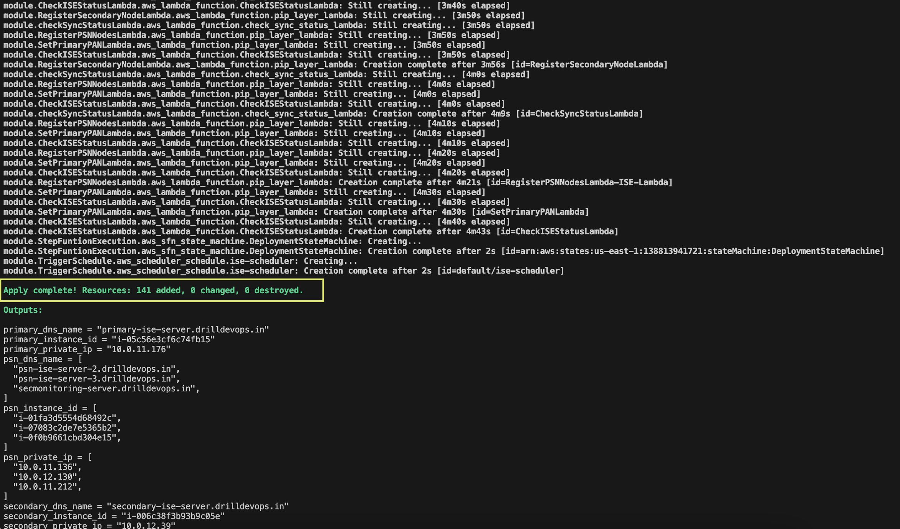

# Automated ISE setup with Infrastructure as Code using Terraform on AWS

This project runs terraform module to setup ISE infrastructure on AWS

## Requirements
- Terraform >= 1.0.0
- AWS CLIv2

## Installations
1. To install terraform, follow the instructions as per your operating system - [Install Terraform](https://developer.hashicorp.com/terraform/tutorials/aws-get-started/install-cli)

2. To install AWS CLIv2, follow the instructions mentioned here - [Install AWS CLIv2](https://docs.aws.amazon.com/cli/latest/userguide/getting-started-install.html)


## Configure AWS
1. To configure and allow access to AWS account, create IAM user with least privilege access policy- [create terraform-iam-policy](./docs/terraform-policy.json). 

      For more comprehensive information on configuring Identity and  Access Management You can find detailed guidance  [here](./docs/iampolicyreadme.md).

 2. create Programmatic Access Key (AWS Access key and Secret key). Follow this document to manage access keys - [How to manage aws access keys](https://docs.aws.amazon.com/IAM/latest/UserGuide/id_credentials_access-keys.html#Using_CreateAccessKey). 

Run aws configure as below and enter the access and secret keys.

```
aws configure
AWS Access Key ID [*******************]: <Enter access key>
AWS Secret Access Key [********************]: <Enter secret key>
Default region name [us-east-2]: 

```

## Prerequisites
Before running terraform modules, follow below steps

1. Subscribe to Cisco ISE product in AWS marketplace
- Login to AWS console and search for AWS Marketplace Subscriptions. 
- In the Manage subscriptions window, select Discover Products in the left pane. Search for Cisco Identity Services Engine (ISE) in the search bar and subscribe to it.

2. Create a ec2 key pair by following this documentation - [Create ec2 key pair](https://docs.aws.amazon.com/AWSEC2/latest/UserGuide/create-key-pairs.html)

3. Setup SSH for git, follow this documentation - [How to setup SSH for git](https://www.warp.dev/terminus/git-clone-ssh) 

4. It is mandatory to create a s3 bucket beforehand to store terraform backend state files which needs to be referenced in below [terraform init command](#terraform_init_command). Storing terraform state files in s3 provides enhanced collaboration, security and durability over keeping state files locally
  - Existing s3 bucket can be used to store the backend files. If you want to create a new bucket, Refer this documentation - [How to create a s3 bucket](https://docs.aws.amazon.com/AmazonS3/latest/userguide/create-bucket-overview.html)
  - After creating s3 bucket, make sure to update the bucket name in the [least privilege access policy](./docs/terraform-policy.json#L206)


## Terraform module structure

To refer the detailed structure of this terraform module, check here - [Module structure](./docs/directory-structure.md)

## Run terraform modules

Clone this git repo by using below this command 
  ```
  git clone https://github3.cisco.com/techops-operation/ise_launch_template-terraform-aws-ec2.git
  ```

Choose one of the following options to setup ISE infra
### 1. [Deploy using an existing VPC](./examples/create-ec2-with-existing-vpc/)

To deploy using an existing VPC
  ```
  cd examples/create-ec2-with-existing-vpc
  ```
  Refer [create-ec2-with-existing-vpc README](./examples/create-ec2-with-existing-vpc/README.md) and update the variables in terraform.tfvars

### 2. [Deploy using a new VPC](./examples/create-ec2-with-new-vpc/)

To deploy using a new VPC
```
cd examples/create-ec2-with-new-vpc
```
Refer [create-ec2-with-new-vpc README](./examples/create-ec2-with-new-vpc/README.md) and update the variables in terraform.tfvars

<a name="terraform_init_command"></a>
After updating terraform.tfvars run the below commands
 ```
 terraform init --upgrade \
    -backend-config="bucket=<bucket_name>" \        # Specify the s3 bucket name created in prerequisites - step 3
    -backend-config="region=<bucket_region>" \      # Specify the s3 bucket region e.g., us-east-1 for N. Virginia
    -reconfigure
 terraform plan
 terraform apply
 ```

Type 'yes' when prompted after running terraform apply

After terraform apply is completed, output block as shown in the below screenshot will be generated


After setting up ISE infra using terraform, it will take 45-60 minutes for the stack to deploy and ISE application to come up

For your reference, below screenshot shows the state machine output after ISE application is successfully launched and running


